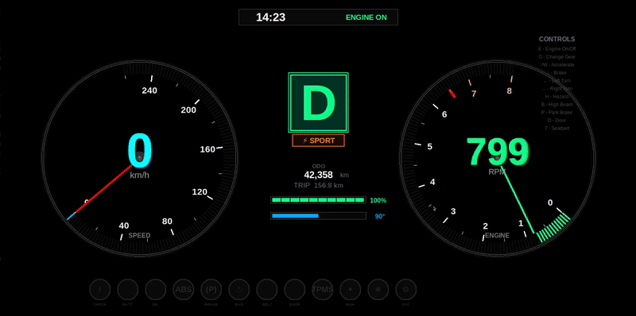

<div align="center">

# 🚗 Interactive CAN Bus Dashboard

### *A Realistic Automotive Dashboard Simulator with CAN Protocol Integration*

[](https://www.python.org/downloads/)
[](LICENSE)
[](https://en.wikipedia.org/wiki/SocketCAN)
[](https://www.linux.org/)


*A professional-grade car dashboard featuring real-time gauges, CAN bus communication, and realistic vehicle physics*

[Features](#-features) • [Installation](#-installation) • [Usage](#-usage) • [CAN Protocol](#-can-protocol-reference) • [Contributing](#-contributing)

</div>

---

## 📋 Table of Contents

- [Overview](#-overview)
- [Features](#-features)
- [Demo](#-demo)
- [Installation](#-installation)
- [Quick Start](#-quick-start)
- [Usage](#-usage)
  - [Keyboard Controls](#keyboard-controls-)
  - [CAN Commands](#can-commands-)
- [CAN Protocol Reference](#-can-protocol-reference)
- [Architecture](#-architecture)
- [Customization](#-customization)
- [Troubleshooting](#-troubleshooting)
- [Contributing](#-contributing)
- [License](#-license)
- [Acknowledgments](#-acknowledgments)

---

## 🎯 Overview

This project is a **fully-featured automotive dashboard simulator** that demonstrates real-world CAN (Controller Area Network) bus communication. Built with Python and Tkinter, it provides a realistic interface for monitoring and controlling vehicle parameters through both keyboard inputs and CAN messages.

### Why This Project?

- 🎓 **Educational**: Learn CAN bus protocols and automotive systems
- 🔧 **Practical**: Test CAN implementations without physical hardware
- 🚀 **Extensible**: Easy to customize and add new features
- 💻 **Accessible**: Works on any Linux system with Python

### Use Cases

- Automotive protocol education and training
- CAN bus development and testing
- Vehicle simulation and modeling
- Security research and penetration testing
- Custom dashboard development

---

## ✨ Features

<div align="center">

### 🎨 **Premium Visual Design**

</div>

| Component | Description |
|-----------|-------------|
| **Speedometer** | 0-260 km/h range with dynamic color gradient (blue→cyan→green→yellow→orange→red) |
| **Tachometer** | 0-8000 RPM with redline warning at 6500+ RPM |
| **Digital Displays** | High-contrast LED-style readouts with multi-layer glow effects |
| **Warning Indicators** | 9 professional warning lights (check engine, oil, battery, etc.) |
| **Turn Signals** | Animated left/right indicators with realistic blink timing |
| **Gauges** | Fuel level and temperature with color-coded warnings |

<div align="center">

### ⚡ **Advanced Features**

</div>

- 🔄 **Real-time CAN Communication**: Send and receive CAN messages via SocketCAN
- ⌨️ **Keyboard Control**: Full dashboard control without CAN hardware
- 🎮 **Realistic Physics**: Acceleration, braking, drag, and engine characteristics
- 🎨 **Professional UI**: Chrome bezels, gradients, shadows, and glow effects
- 📊 **Multiple Gauges**: Speed, RPM, fuel, temperature, gear position
- ⚠️ **Warning System**: Check engine, battery, seatbelt, ABS, TPMS, and more
- 🔊 **Audio Support**: Engine sounds and turn signal audio (optional)
- 🎯 **Dual Control**: Keyboard shortcuts OR CAN message control

---

## 🎬 Demo

<div align="center">



*Dashboard in action: Acceleration, turn signals, and warning indicators*

</div>

### Quick Demo Scenarios

```bash
# Scenario 1: Normal driving (keyboard)
Press: E → G → ↑↑↑ → ← → ↓↓

# Scenario 2: Hit the redline!
Press: E → G → Hold ↑ until RPM > 6500 (needle turns RED!)

# Scenario 3: CAN control
cansend vcan0 100#64    # 100 km/h
cansend vcan0 101#41    # 6500 RPM (redline)
```

---

## 🔧 Installation

### Prerequisites

- **Operating System**: Linux (Ubuntu, Debian, Kali, Arch, etc.)
- **Python**: 3.7 or higher
- **CAN Interface**: vcan0 (virtual) or real CAN hardware

### Step 1: Clone the Repository

```bash
git clone https://github.com/yourusername/Car-HACK.git
cd Car-HACK
```

### Step 2: Install System Dependencies

```bash
# Install CAN utilities (for cansend/candump commands)
sudo apt update
sudo apt install can-utils

# Install Tkinter (if not already installed)
sudo apt install python3-tk

# Optional: Install PortAudio for sound support
sudo apt install portaudio19-dev python3-pyaudio
```

### Step 3: Install Python Dependencies

```bash
# Required packages
pip install python-can

# Optional: For audio support (disabled by default for performance)
pip install pyaudio numpy
```

### Step 4: Setup Virtual CAN Interface

```bash
# Load the vcan kernel module
sudo modprobe vcan

# Create virtual CAN interface
sudo ip link add dev vcan0 type vcan
sudo ip link set up vcan0

# Verify it's working
ip link show vcan0
```

**Expected output:**
```
3: vcan0: <NOARP,UP,LOWER_UP> mtu 72 qdisc noqueue state UNKNOWN
```

#### Make it Persistent (Optional)

To automatically create vcan0 on boot:

```bash
# Create systemd service
sudo nano /etc/systemd/system/vcan.service
```

Add this content:
```ini
[Unit]
Description=Virtual CAN Interface
After=network.target

[Service]
Type=oneshot
RemainAfterExit=yes
ExecStart=/sbin/modprobe vcan
ExecStart=/sbin/ip link add dev vcan0 type vcan
ExecStart=/sbin/ip link set up vcan0

[Install]
WantedBy=multi-user.target
```

Enable the service:
```bash
sudo systemctl enable vcan.service
sudo systemctl start vcan.service
```

### 🪟 Windows (WSL2) Users

**Note**: The vcan kernel module may not be available in WSL2. You have two options:

1. **Use Keyboard Controls Only** (Works immediately, no setup required)
2. **Compile Custom WSL2 Kernel** with CAN support (Advanced)

The dashboard will work with keyboard controls even if vcan0 is unavailable.

---

## 🚀 Quick Start

### Option 1: Fastest Way (3 steps)

```bash
# 1. Start the dashboard
python3 main-dash.py

# 2. Click on the dashboard window to focus it

# 3. Press keys:
#    E     → Engine On
#    ↑     → Accelerate
#    G     → Change Gear
#    ←/→   → Turn Signals
```

### Option 2: Full CAN Testing

**Terminal 1** - Dashboard:
```bash
python3 main-dash.py
```

**Terminal 2** - Monitor CAN traffic:
```bash
candump vcan0
```

**Terminal 3** - Send CAN commands:
```bash
cansend vcan0 100#64    # Set speed to 100 km/h
cansend vcan0 101#28    # Set RPM to 4000
cansend vcan0 300#01    # Left turn signal ON
```

---

## 📖 Usage

The dashboard supports **two control methods**: Keyboard (always works) and CAN messages (requires vcan0).

### Keyboard Controls ⌨️

<div align="center">

| Key | Function | Description |
|:---:|----------|-------------|
| `E` | Engine On/Off | Toggle engine (800 RPM idle / 0 RPM off) |
| `↑` or `W` | Accelerate | Increase throttle, speed, and RPM |
| `↓` | Brake | Decrease speed |
| `G` | Change Gear | Cycle through P → R → N → D → P |
| `←` | Left Turn Signal | Toggle left indicator |
| `→` | Right Turn Signal | Toggle right indicator |
| `H` | Hazard Lights | Toggle both turn signals |
| `P` | Parking Brake | Toggle parking brake warning |
| `T` | Seatbelt | Toggle seatbelt warning |
| `B` | High Beam | Toggle high beam indicator |
| `D` | Door | Toggle door ajar warning |

</div>

**💡 Tip**: Dashboard window must be focused (clicked) to receive keyboard input.

---

### CAN Commands 📡

The dashboard listens on **vcan0** interface for CAN messages. All commands use standard CAN 2.0A format (11-bit identifier).

#### Basic CAN Command Format

```bash
cansend vcan0 <ID>#<DATA>

# Example:
cansend vcan0 100#64    # ID=0x100, Data=0x64 (100 decimal)
```

#### Vehicle Control Commands

```bash
# Speed Control (0x100)
cansend vcan0 100#00    # 0 km/h
cansend vcan0 100#32    # 50 km/h
cansend vcan0 100#64    # 100 km/h
cansend vcan0 100#C8    # 200 km/h

# RPM Control (0x101) - Value × 100
cansend vcan0 101#08    # 800 RPM (idle)
cansend vcan0 101#14    # 2000 RPM
cansend vcan0 101#28    # 4000 RPM
cansend vcan0 101#41    # 6500 RPM (redline!)

# Gear Selection (0x102)
cansend vcan0 102#00    # Park
cansend vcan0 102#01    # Reverse
cansend vcan0 102#02    # Neutral
cansend vcan0 102#03    # Drive

# Fuel Level (0x103) - Percentage
cansend vcan0 103#64    # 100% (full)
cansend vcan0 103#32    # 50%
cansend vcan0 103#14    # 20% (warning)
cansend vcan0 103#00    # 0% (empty)

# Temperature (0x104) - Celsius
cansend vcan0 104#5A    # 90°C (normal)
cansend vcan0 104#69    # 105°C (warning)
cansend vcan0 104#78    # 120°C (overheat!)
```

#### Warning Indicators (0x200-0x208)

```bash
cansend vcan0 200#01    # Check Engine: ON
cansend vcan0 200#00    # Check Engine: OFF

cansend vcan0 201#01    # Battery Warning: ON
cansend vcan0 202#01    # Seatbelt Warning: ON
cansend vcan0 203#01    # ABS Warning: ON
cansend vcan0 204#01    # Oil Pressure: ON
cansend vcan0 205#01    # Parking Brake: ON
cansend vcan0 206#01    # High Beam: ON
cansend vcan0 207#01    # TPMS (Tire Pressure): ON
cansend vcan0 208#01    # Airbag Warning: ON
```

#### Turn Signals & Door (0x300-0x302)

```bash
cansend vcan0 300#01    # Left Turn Signal: ON
cansend vcan0 300#00    # Left Turn Signal: OFF

cansend vcan0 301#01    # Right Turn Signal: ON
cansend vcan0 301#00    # Right Turn Signal: OFF

cansend vcan0 302#01    # Door Ajar: ON
cansend vcan0 302#00    # Door Closed
```

#### Monitoring CAN Traffic

```bash
# Monitor all CAN traffic
candump vcan0

# Monitor specific IDs
candump vcan0,100:104           # Vehicle data only
candump vcan0,200:208           # Warnings only

# Log to file
candump vcan0 -l can_log.txt

# Replay CAN log
canplayer -I can_log.txt vcan0
```

---

## 📡 CAN Protocol Reference

### Complete CAN ID Map

<div align="center">

| ID (Hex) | ID (Dec) | Category | Parameter | Data Format | Range |
|:--------:|:--------:|----------|-----------|-------------|-------|
| `0x100` | 256 | Vehicle | Speed | 1 byte (km/h) | 0-260 |
| `0x101` | 257 | Vehicle | RPM | 1 byte (×100) | 0-8000 |
| `0x102` | 258 | Vehicle | Gear | 1 byte (enum) | 0=P, 1=R, 2=N, 3=D |
| `0x103` | 259 | Vehicle | Fuel | 1 byte (%) | 0-100 |
| `0x104` | 260 | Vehicle | Temperature | 1 byte (°C) | 0-150 |
| `0x200` | 512 | Warning | Check Engine | 1 byte (bool) | 0=OFF, 1=ON |
| `0x201` | 513 | Warning | Battery | 1 byte (bool) | 0=OFF, 1=ON |
| `0x202` | 514 | Warning | Seatbelt | 1 byte (bool) | 0=OFF, 1=ON |
| `0x203` | 515 | Warning | ABS | 1 byte (bool) | 0=OFF, 1=ON |
| `0x204` | 516 | Warning | Oil Pressure | 1 byte (bool) | 0=OFF, 1=ON |
| `0x205` | 517 | Warning | Parking Brake | 1 byte (bool) | 0=OFF, 1=ON |
| `0x206` | 518 | Warning | High Beam | 1 byte (bool) | 0=OFF, 1=ON |
| `0x207` | 519 | Warning | TPMS | 1 byte (bool) | 0=OFF, 1=ON |
| `0x208` | 520 | Warning | Airbag | 1 byte (bool) | 0=OFF, 1=ON |
| `0x300` | 768 | Signal | Left Turn | 1 byte (bool) | 0=OFF, 1=ON |
| `0x301` | 769 | Signal | Right Turn | 1 byte (bool) | 0=OFF, 1=ON |
| `0x302` | 770 | Signal | Door | 1 byte (bool) | 0=Closed, 1=Open |

</div>

### Hex ↔ Decimal Conversion Table

<details>
<summary><b>Click to expand conversion table</b></summary>

```
Hex  Dec  |  Hex  Dec  |  Hex  Dec  |  Hex  Dec
00 = 0    |  19 = 25   |  32 = 50   |  64 = 100
01 = 1    |  1E = 30   |  37 = 55   |  69 = 105
05 = 5    |  23 = 35   |  3C = 60   |  6E = 110
0A = 10   |  28 = 40   |  41 = 65   |  78 = 120
0F = 15   |  2D = 45   |  46 = 70   |  96 = 150
14 = 20   |             |  5A = 90   |  C8 = 200
```

**Formula**: Hex to Dec: `0x28 = 40`, Dec to Hex: `40 = 0x28`

</details>

### Example Scenarios

<details>
<summary><b>Scenario 1: Normal City Driving</b></summary>

```bash
# Start engine
cansend vcan0 102#03    # Shift to Drive
cansend vcan0 100#00    # Start from 0 km/h
cansend vcan0 101#08    # 800 RPM idle

# Accelerate to 50 km/h
cansend vcan0 100#32    # 50 km/h
cansend vcan0 101#14    # 2000 RPM

# Turn left
cansend vcan0 300#01    # Left signal ON
sleep 2
cansend vcan0 300#00    # Left signal OFF

# Slow down
cansend vcan0 100#19    # 25 km/h
cansend vcan0 101#0C    # 1200 RPM

# Stop
cansend vcan0 100#00    # 0 km/h
cansend vcan0 101#08    # 800 RPM
cansend vcan0 102#00    # Park
```

</details>

<details>
<summary><b>Scenario 2: Highway Acceleration</b></summary>

```bash
# Aggressive acceleration to highway speed
cansend vcan0 102#03    # Drive
cansend vcan0 100#50    # 80 km/h
cansend vcan0 101#23    # 3500 RPM
sleep 1
cansend vcan0 100#78    # 120 km/h
cansend vcan0 101#2D    # 4500 RPM
sleep 1
cansend vcan0 100#96    # 150 km/h
cansend vcan0 101#37    # 5500 RPM
```

</details>

<details>
<summary><b>Scenario 3: Emergency Warning Test</b></summary>

```bash
# Critical warnings
cansend vcan0 103#0A    # 10% fuel (low fuel warning)
cansend vcan0 104#78    # 120°C (overheat warning)
cansend vcan0 200#01    # Check engine ON
cansend vcan0 204#01    # Oil pressure warning ON
cansend vcan0 207#01    # TPMS warning ON

# Activate hazard lights
cansend vcan0 300#01    # Left signal ON
cansend vcan0 301#01    # Right signal ON

# Pull over
cansend vcan0 100#00    # Stop
cansend vcan0 205#01    # Parking brake ON
```

</details>

---

## 🏗️ Architecture

### Technology Stack

- **GUI Framework**: Tkinter (Python standard library)
- **CAN Interface**: python-can with SocketCAN
- **Graphics**: Canvas-based 2D rendering
- **Audio**: PyAudio (optional)
- **Physics**: Custom vehicle dynamics simulation

### Project Structure

```
Car-HACK/
│
├── main-dash.py              # Main application
│   ├── CAN Interface         # SocketCAN communication
│   ├── GUI Renderer          # Tkinter canvas drawing
│   ├── Physics Engine        # Vehicle dynamics
│   ├── Audio System          # Engine & signal sounds (optional)
│   └── Event Handlers        # Keyboard & CAN message processing
│
├── CAN_ID_MAP.md             # Complete protocol documentation
├── KEYBOARD_CONTROLS.txt     # Keyboard shortcuts reference
├── README.md                 # This file
└── LICENSE                   # MIT License
```

### Key Components

```python
# CAN Bus Interface
bus = can.interface.Bus(channel="vcan0", interface="socketcan")

# GUI Setup
root = tk.Tk()
canvas = tk.Canvas(root, width=1200, height=700, bg="#1a1a1a")

# Physics Simulation (60 FPS)
def physics_update():
    # Acceleration, drag, braking
    # Fuel consumption
    # Temperature simulation
    
# Rendering (30 FPS)
def render():
    # Draw speedometer, tachometer
    # Update warning lights
    # Animate turn signals
```

---

## 🎨 Customization

### Adjust Dashboard Appearance

Edit `main-dash.py` to customize colors, sizes, and layout:

```python
# Line ~700: Speedometer colors
speed_colors = [
    (0, "#0088FF"),      # Blue
    (40, "#00D4FF"),     # Cyan
    (80, "#00FF88"),     # Green
    (140, "#FFFF00"),    # Yellow
    (200, "#FF8800"),    # Orange
    (260, "#FF0000")     # Red
]

# Line ~800: RPM colors (change redline point)
REDLINE_RPM = 6500  # Default redline starts here

# Line ~500: Warning light positions
warning_positions = [
    (100, 650),  # Check engine
    (200, 650),  # Battery
    # Add more positions...
]
```

### Enable Audio

```python
# Line ~21: Enable audio (disabled by default for performance)
ENABLE_AUDIO_ATTEMPT = True  # Change from False to True
```

**Note**: Requires `pyaudio` to be installed.

### Add New CAN IDs

```python
# Line ~1240: Add new CAN message handler
def read_can():
    msg = bus.recv(timeout=0.01)
    if msg:
        if msg.arbitration_id == 0x105:  # New ID
            # Handle your custom parameter
            custom_value = msg.data[0]
```

---

## 🐛 Troubleshooting

### Dashboard Won't Start

**Error**: `ModuleNotFoundError: No module named 'can'`

**Solution**:
```bash
pip install python-can
```

---

**Error**: `OSError: [Errno 19] No such device 'vcan0'`

**Solution**:
```bash
sudo modprobe vcan
sudo ip link add dev vcan0 type vcan
sudo ip link set up vcan0
```

If on WSL2 and modprobe fails, use **keyboard controls** instead (works without vcan0).

---

### Keyboard Controls Not Working

**Problem**: Pressing keys has no effect

**Solutions**:
1. ✅ Click on the dashboard window to focus it
2. ✅ Make sure keyboard layout is English/US
3. ✅ Check if another application is capturing keyboard input

---

### CAN Messages Not Received

**Problem**: `cansend` commands don't update the dashboard

**Diagnostic**:
```bash
# Terminal 1: Start dashboard
python3 main-dash.py

# Terminal 2: Check if message is sent
candump vcan0 &
cansend vcan0 100#64

# You should see:
# vcan0  100   [1]  64
```

**Solutions**:
- Verify vcan0 is up: `ip link show vcan0`
- Check firewall isn't blocking CAN
- Ensure dashboard is running when you send messages

---

### Performance Issues / Lag

**Problem**: Dashboard is slow or choppy

**Solutions**:
1. Disable audio (set `ENABLE_AUDIO_ATTEMPT = False`)
2. Close other resource-intensive applications
3. Reduce refresh rate (edit `root.after()` values in code)
4. Run on faster hardware

---

### Visual Glitches

**Problem**: Needles jumping, colors wrong, missing elements

**Solutions**:
- Update graphics drivers
- Try different display resolution
- Check Python/Tkinter version: `python3 --version`
- Reinstall Tkinter: `sudo apt install --reinstall python3-tk`

---

### WSL2 Specific Issues

**Problem**: vcan module not found in WSL2

**Explanation**: WSL2 uses a Microsoft-compiled kernel that doesn't include vcan support by default.

**Solutions**:
1. **Use keyboard controls** (recommended, works immediately)
2. **Compile custom WSL2 kernel** with CAN support ([Guide](https://github.com/microsoft/WSL2-Linux-Kernel))
3. **Use native Linux** via dual-boot or VM
---

## 📄 License

This project is licensed under the **MIT License** - see the [LICENSE](LICENSE) file for details.

```
MIT License

Copyright (c) 2025 Car-HACK Contributors

Permission is hereby granted, free of charge, to any person obtaining a copy
of this software and associated documentation files (the "Software"), to deal
in the Software without restriction, including without limitation the rights
to use, copy, modify, merge, publish, distribute, sublicense, and/or sell
copies of the Software, and to permit persons to whom the Software is
furnished to do so, subject to the following conditions:

The above copyright notice and this permission notice shall be included in all
copies or substantial portions of the Software.

THE SOFTWARE IS PROVIDED "AS IS", WITHOUT WARRANTY OF ANY KIND, EXPRESS OR
IMPLIED, INCLUDING BUT NOT LIMITED TO THE WARRANTIES OF MERCHANTABILITY,
FITNESS FOR A PARTICULAR PURPOSE AND NONINFRINGEMENT.
```

---
```

*Press `E` to start the engine, `↑` to accelerate, and enjoy the ride! 🏁*

</div>
